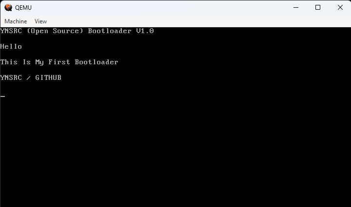

# Simple Bootloader with NASM

# Build And Run
To build, you need nasm and mkisofs to make bootloader binary and iso file.

When ISO file successfully generated, you can use it in any VM such as VirtualBox, VMWare
or you can burn it a CD/DVD or USB to boot a real device too.

You can `make` to build or `make run` to build and start with qemu if installed.

# See also
1. https://en.wikipedia.org/wiki/BIOS_interrupt_call
2. https://en.wikipedia.org/wiki/INT_10H
3. https://en.wikipedia.org/wiki/INT_16H

# License
The Unlicense. Feel free to use or change it how you need.
